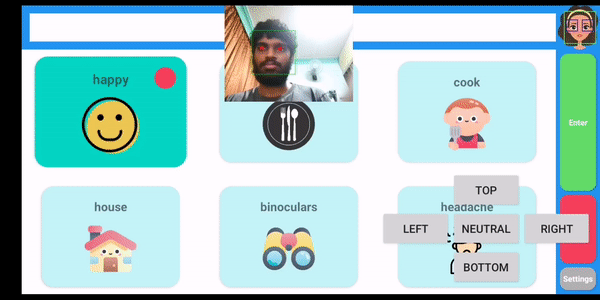
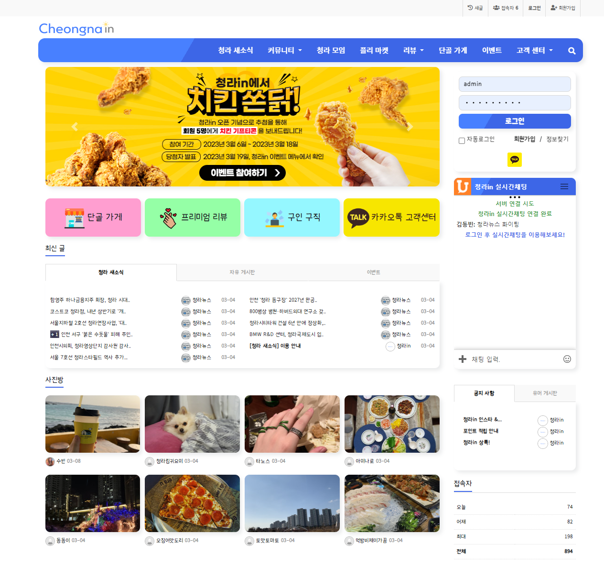
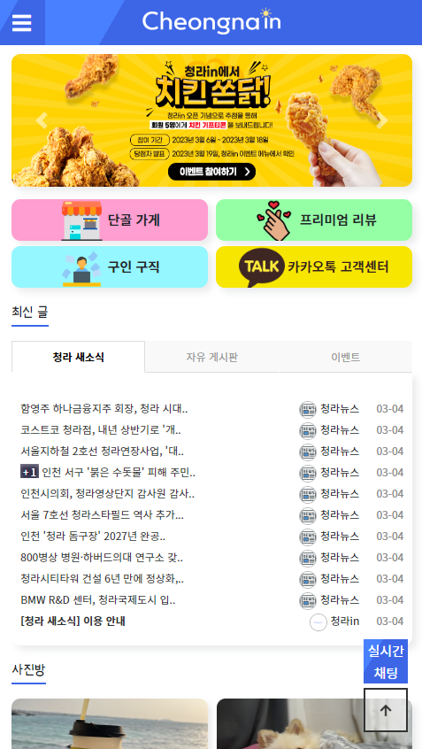
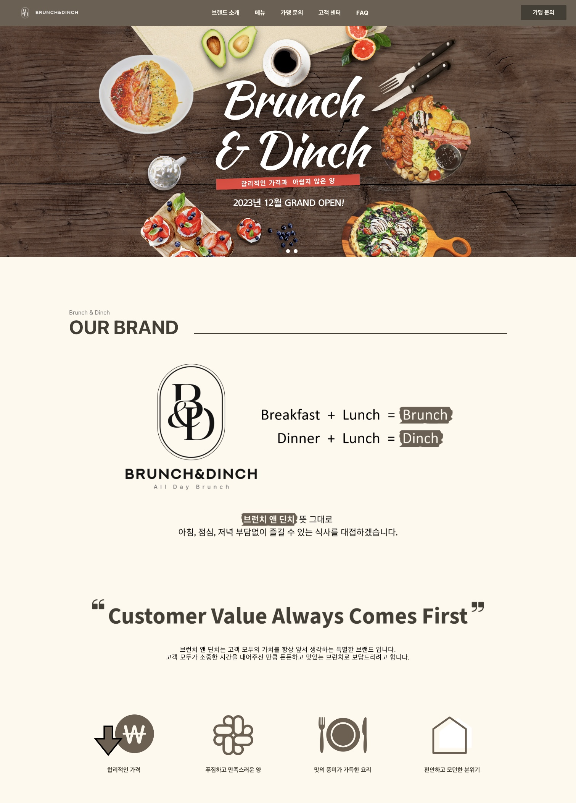
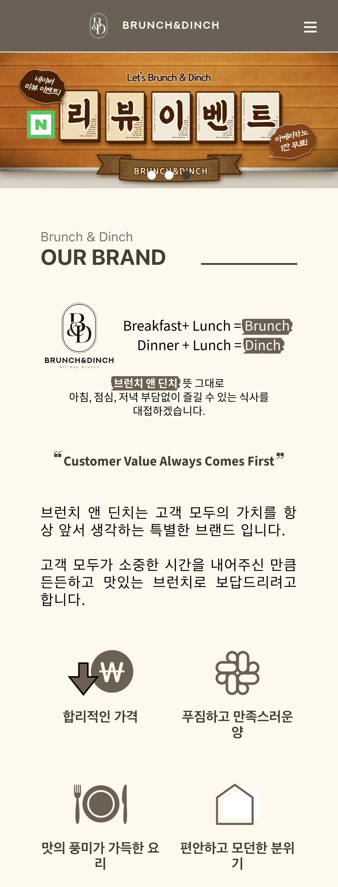

# Portfolio
이수빈, Soobin (Ben) Lee,의 포트폴리오 입니다.
 
현재 Unity로 한 게임을 제작중에 있으며, 이는 아직 업로드 되지 않음을 알려드립니다. 
 

**포트플리오 구성 **
1. 대학과정 중 진행한 크고 작은 프로젝트
  * Iceberg_challenge: `Javascript p5`를 이용해 개발한 게임으로, 지구 온난화를 시각화한 게임입니다.
  * tracking_pupils_app: 호주의 PwC 라는 회사와 협업하여, `Python OpenCV`를 이용하여 파킨슨 병과 같이 몸을 자유자재로 움직일 수 없는 분들을 위하여 동공 추적을 해 앱을 손을 이용하지 않고 오로지 동공의 움직임으로만 조종할 수 있는, `Android Studio`에서 `Java`를 이용해 개발한 어플입니다.
  * Dungeon_Seeker: `Unity3D`로 개발한 일반 몬스터를 처치하며 얻은 열쇠 길을 찾고 캐릭터의 다양한 업그레이드를 통해 총 2마리의 보스 몬스터를 처치하는 게임입니다.

2. 개인 프로젝트
  * 청라인: `PHP` 기반인 `그누보드`라는 솔루션을 이용하여 청라 대표 커뮤니티를 목표로 주민들의 다양한 소통과 활동을 위해 웹사이트를 제작하였습니다.
  * brunch_dinch_website: `Node JS`를 이용해 브런치앤딘치라는 브런치 카페의 웹사이트를 제작하였습니다.

**1. Iceberg_challenge**
* 종류:  `2D 게임` / `1인 프로젝트`
* 언어:  `English`
* 개발 언어:  `Javascript P5`  

프로젝트 설명:  
이 프로젝트는 게임을 처음으로 개발한 프로젝트 입니다. Javascript와 P5.js 라이브러리를 이용하여 2D 게임을 구현하였습니다. 매 프레임마다 호출되는 Draw() 함수의 사용을 통해 게임의 기본 메커니즘을 학습하였습니다. 게임의 기획부터 디자인, 개발까지 모든 과정을 직접 수행하여 개발 역량을 키웠습니다. 주요 개발 사항은 다음과 같습니다:

* **게임 메커닉 구현:** 플레이어의 이동, 공격, 업그레이드 시스템 등 게임의 핵심 메커니즘을 Javascript를 사용하여 구현하였습니다.
* **지구 온난화 시각화:** 빙하가 매 초 줄어드는 시각적 효과를 통해 지구 온난화 문제를 게임 내에서 효과적으로 전달하였습니다.
* **UI 및 UX 디자인:** 플레이어의 상호작용을 극대화하기 위해 직관적인 UI와 사용자 경험을 설계하였습니다.
* **게임 밸런싱:** 게임의 난이도와 업그레이드 시스템을 조정하여 플레이어가 도전과 재미를 느낄 수 있도록 하였습니다.

처음으로 만든 게임인 만큼 부족함이 많지만 실제 게임 개발의 전반적인 메커니즘을 학습할 수 있는 기초적인 계기가 되었습니다.

게임 설명:  
이 게임의 컨셉은 지구 온난화의 시각화를 바탕으로 만들어 게임입니다. 빙하가 매 초 줄어드는 것을 시각적으로 표현되어 플레이어의 흥미를 자극 시킵니다. 쓰레기의 효율적인 처리를 위해 능력치를 업그레이드를 할 수 있지만, 골드를 사용하여 업그레이드를 하지 않는 일반 업그레이드는 횟수만큼 빙하가 줄어들게 됩니다. 이는 지구 자원을 통한 업그레이드로 표현되는 한 장치입니다.

* W, A, S, D 로 움직이며, `spacebar`의 연타로 쓰레기를 처리 가능합니다.
* 시작하자마자 스폰되는 화면 왼쪽의 방 (이글루)에서는 빙하가 가라앉지 않고 그 안에 있는 연습용 쓰레기를 통해 공격력의 테스트가 가능합니다.
* 각 문을 통해 빙하와 이글루를 게임 플레이중 어느때나 이동 가능합니다.
* 능력치 강화는 왼쪽 방 (이글루)에서만 가능합니다.
* `+` 버튼을 사용하면 골드 소모 없이 능력치의 강화가 가능하지만 그 대신 빙하가 줄어듭니다.
* `++` 버튼을 사용하면 빙하가 줄어들지는 않지만 골드 8개가 소모됩니다.
* 한개의 쓰레기를 처리하면 2 골드를 얻게 됩니다.
* 매초 빙하는 감소하게 됩니다.
* 쓰레기를 일정량 처리하게 되면 빙하가 다시 어느정도 복구되어 다시 올라옵니다.

게임 플레이  
   

**2. tracking_pupils_app**
* 종류:  `Android App` / `3인 프로젝트`
* 협업사:  `PwC Australia`
* 언어:  `English`
* 개발 환경:  `Android Studio`
* 개발 언어:  `Java`, `Python`  

프로젝트 설명:  
이 프로젝트는 호주의 PwC Australia 라는 회사와 연계 협업으로 1년간 진행한 프로젝트로, 동공 추적을 바탕으로 물리적 상호작용 없이 앱을 이용하는데 목적을 두어 개발한 앱입니다. 대부분의 개발을 `Java`로 개발하다가 처음으로 python의 external library를 접목시켜 진행된 프로젝트 입니다. 기여 사항은 다음과 같습니다:

* **Main Developer:** 앱의 전반적인 인터페이스를 `Android Studio`에서 `Java` 언어를 이용해 개발하였습니다. 또한, Pupil Tracking의 정확도를 개선하기 위해 알고리즘을 반복적으로 수정해 나가며 향상시켰습니다.
* **Product Owner:** 팀의 속도를 항상 이해하며 `back log` 항목의 `release`를 지속적으로 체크하며 예측했습니다.

처음으로 다른 회사와 연계 협업으로 당사의 Client와 프로젝트를 진행했습니다. 그동안은 개발의 퀄리티나 작동에만 신경을 썼었지만, Client와 의견을 정기적으로 소통을 통해 나눠가며 프로젝트의 방향성을 잡고 진행했던 인상깊었던 프로젝트입니다.

앱 설명:  
`Python`의 `OpenCV Library`를 이용하여 `Face Recognition`을 바탕으로 `동공(pupils)`을 트래킹 하는 알고리즘을 개발하여 파킨슨 병과 같이 몸을 자유자재로 움직일 수 없어 제대로 된 의사소통이 불가능한 사람들을 위해 앱을 개발하였습니다.

앱 데모  
   

**3. Dungeon_Seeker**
* 종류:  `3D 게임` / `4인 프로젝트`
* 역할:  `Main Developer`, `Game Environment & Logic Developer`
* 언어:  `English`
* 개발 환경:  `Unity`
* 개발 언어:  `C#`  
* 데모 플레이:  https://play.unity.com/mg/other/anu2023-dungen_seeker  

프로젝트 설명:  
이 프로젝트는 Unity와 C#을 이용한 첫 게임 개발 프로젝트로, 게임 개발의 전 과정을 경험할 수 있는 기회였습니다. 팀의 메인 개발자로서, 게임 환경과 맵, 로직 개발을 담당했습니다. 주요 기여 사항은 다음과 같습니다:

* **게임 메커닉 구현:** 플레이어의 이동, 공격, 마나 관리 등의 기본적인 게임 mechanics를 C#을 사용하여 구현했습니다.
* **AI 몬스터:** 몬스터가 플레이어를 트래킹하는 것을 `navmesh`를 이용하여 설계하여, 플레이어를 추적하고 공격하는 로직을 구현했습니다.
* **게임 밸런싱:** 난이도 설정에 따라 몬스터의 체력, 스폰율 등을 조절하여 게임의 밸런스를 맞추었습니다.
* **UI & UX:** 플레이어의 HP와 마나 상태, 난이도 선택 메뉴 등 다양한 UI 요소를 개발하여 사용자 경험을 향상시켰습니다.
* **버그 수정 및 최적화:** 개발 과정에서 발생한 버그를 수정하고, 게임의 성능을 최적화하여 원활한 플레이 경험을 제공했습니다.

이 프로젝트를 통해 게임 개발의 기본 개념을 이해하고, Unity와 C#을 활용한 실질적인 문제 해결 능력을 키울 수 있었습니다. 또한, 팀원들과의 협업을 통해 프로젝트 관리를 효율적으로 수행하는 법을 배웠습니다.

게임 설명:  
플레이어는 마법 지팡이를 이용하여 두가지의 매직 파워 구체를 사용 하여 공격을 할 수 있습니다. 공격 시 구체에 따라 마나가 소모 되며, 마나 회복은 자동 재생 또는 몬스터 처치 시 일정 확률로 드랍되는 마나 회복 포션을 통해 이뤄집니다. 게임의 최종 목표는 두 보스를 처치하는 것이며, 각 보스를 처치 하기 위해서는 일반 몬스터의 처치를 통해 일정 확률로 드랍되는 열쇠를 획득하여 보스가 있는 곳으로 진입 가능합니다. 캐릭터의 능력치는 일반 믄소터 처치 시 일정 확률로 드랍되는 골드를 통해 업그레이드가 가능합니다.
* W, A, S, D 로 움직이며, 마우스로 조준 후 왼쪽 마우스 클릭으로 공격
* 일반 몬스터는 난이도에 따라 스폰율이 달라지며, 캐릭터에게 항상 다가옵니다.
* 몬스터와 가까워 지면 몬스터는 캐릭터에게 공격을 하며 공격을 당하면 캐릭터의 HP가 감소합니다.
* 게임의 난이도는 `Beginner`, `Medium`, `Nightmare` 로 총 3가지로 구성되어 있으며 난이도에 따라 몬스터의 최대 체력과 스폰율이 증가합니다.
* 총 두가지의 보스가 등장 합니다.

게임 플레이  
   

**4. 청라인**
* 종류:  `반응형 동기 웹사이트` / `1인 프로젝트`
* 언어:  `한국어`
* 솔루션:  `그누보드5`
* 개발 언어:  `PHP`, `HTML`, `CSS`, `JS`, `MySQL`  

프로젝트 설명:  
저만의 프로젝트를 개발해보고 싶어 무작정 개발했던 커뮤니티 프로젝트 이며, 휴학에서 복학하기전 몇 달간 실제 운영을 했던 웹사이트 입니다.

처음으로 `MySQL`를 이용해 서버에 저장을 하고 `Session`을 이용해 로그인 및 다양한 정보를 일시적으로 저장해, 자동로그인 등 회원의 편의성을 향상시켰습니다. `Post` 와 `Get`의 이용을 확실하게 학습하고 이용할 수 있었던 계기가 되었습니다. `PHP`를 이용해 처음부터 개발하는 것 보다 `PHP`로 이미 만들어진 솔루션을 제 뜻대로 수정하고 뜯어 고치며 `PHP`에 대해서 깊게 학습할 수 있는 계기가 되어 자신감이 생겼습니다.

웹사이트 설명:  
인천 서구에 위치하고 있는 청라의 활발한 소식 공유 및 이웃 활동을 위해 커뮤니티 사이트를 개발하였습니다. 중고 거래, 실시간 채팅, 이벤트, 뉴스, 등 주민들간의 편의성에 초점을 맞춘 웹사이트 입니다. 개발 당시 `그누보드5` 라는 솔루션을 이용하여, 기본 제공되는 포맷의 레이아웃 및 디자인을 새롭게 수정하였습니다.

웹사이트 사진  
   

**5. brunch_dinch_website**
* 종류:  `반응형 비동기 웹사이트` / `1인 프로젝트`
* 언어:  `한국어`
* 개발 환경:  `Node.js`
* 개발 언어:  `JavaScript`, `HTML`, `CSS`  
* 웹사이트:  http://www.bdinch.com  

프로젝트 설명:  
이전에는 웹사이트 개발 공부를 할 때 코드 수정 후 항상 저장 후 새로고침을 해야만 웹사이트의 변경사항을 확인할 수 있었습니다. 단순히 저장 만 하면 바로바로 변경사항이 보일 수 있는 방법은 없을까 하다가 Node.js에 대해서 정보를 접했고, 상당 수의 웹사이트도 이로 개발된 경우가 많다는 것을 알고 무작정 개발을 시작했습니다. 결과적으로 비동기, 동기 웹사이트 개발을 모두 경험하여 이의 차이점, 장단점을 확실하게 학습할 수 있는 계기가 되었습니다.

웹사이트 설명:  
제 가족의 브런치 카페, 브런치 앤 딘치 개업으로 소개 및 메뉴들을 담은 웹사이트를 Node.js의 환경에서 개발하였습니다.

웹사이트 사진  
   
